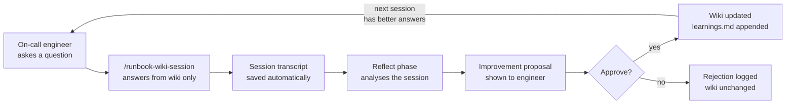

# DevOps Runbook Wiki

A self-improving runbook knowledge base for on-call engineers. Query it during incidents,
and it learns from every session — gaps in coverage get proposed as wiki improvements after each query.


---

## The Problem

Runbooks go stale. Engineers write them once, incidents evolve, and the wiki slowly drifts from reality.
The next on-call engineer searches for "connection pool exhausted" and finds a page last updated 18 months ago.

This system closes that loop: every session where the wiki couldn't answer a question becomes a proposal to fix it.

---

## How It Works



**Four skills, one loop:**

| Skill | When to run | What it does |
|---|---|---|
| `/runbook-wiki-session` | During an incident | Runs the full loop: query → answer → save → reflect → propose → apply |
| `/runbook-wiki` | Quick lookup only | Answers from wiki and saves transcript — no reflect |
| `/runbook-wiki-reflect <session-id>` | After a saved session | Reads transcript, classifies gap, proposes changes, waits for approval |
| `/runbook-wiki-ingest <job>` | When configs change | Compiles SLO configs + service manifests into wiki pages |

---

## The Full Loop — `/runbook-wiki-session`

This is the primary skill. Run it at the start of any incident.

```
/runbook-wiki-session api-gateway is returning high latency, p99 > 800ms
```

It runs six phases without you having to chain anything:

```
Phase 1 — Query        Read wiki, answer the question, cite sources
Phase 2 — Follow-ups   Engineer can ask follow-up questions in the same session
Phase 3 — Save         Write sessions/<id>-transcript.json automatically
Phase 4 — Reflect      Classify: Loop A (protocol failure) / B (wiki gap) / C (clean)
Phase 5 — Propose      Show exactly what to add or fix — fenced code block, exact file
Phase 6 — Apply        Engineer approves or rejects; wiki updated or left unchanged
```

---

## Quick Query — `/runbook-wiki`

For quick lookups when you don't want the full reflect loop:

```
/runbook-wiki user-service health check failing, OOMKilled
```

Reads `wiki/incidents/_index.md`, finds the incident page, reads the service page for SLO context,
answers with sources cited. Saves a transcript automatically so you can run reflect later.

---

## Reflect on a Saved Session — `/runbook-wiki-reflect`

Run reflect on any saved session by ID:

```
/runbook-wiki-reflect 20260501T160045Z-gap
```

The reflect skill reads the transcript, classifies the session into Loop A/B/C,
proposes specific wiki improvements, and waits for your approval before changing anything.

---

## Ingest from Configs — `/runbook-wiki-ingest`

When service configs change, recompile the wiki:

```
/runbook-wiki-ingest services     ← compile wiki/services/ from SLO + alert configs
/runbook-wiki-ingest playbooks    ← compile wiki/playbooks/ from service manifests
/runbook-wiki-ingest incidents    ← regroup alerts into wiki/incidents/ + update _index.md
```

Reads from `_git_snapshot/configs/` and `_git_snapshot/manifests/` (host-managed, read-only).
Writes directly to `wiki/`. Never reads live infrastructure.

---

## The Reflect Loop — Three Outcomes

| Loop | What happened | What changes |
|---|---|---|
| **A — Protocol failure** | Skill read raw configs or called live tools | Prompt corrected, not wiki |
| **B — Wiki gap** | Protocol correct, wiki lacked the answer | New content added to wiki |
| **C — Clean** | Session resolved on first try | Logged to learnings.md, nothing changed |

---

## Wiki Structure

```
wiki/
├── incidents/
│   ├── _index.md              ← symptom triage — start here
│   ├── high-latency.md
│   ├── service-down.md
│   └── db-connection-failure.md
├── services/
│   ├── api-gateway.md         ← SLOs, alerts, escalation per service
│   └── user-service.md
├── playbooks/
│   ├── _index.md
│   ├── rollback.md
│   ├── escalation.md
│   └── db-failover.md
├── runbooks/
│   └── latency-investigation.md
├── resolutions/               ← past resolved incidents (added over time)
└── learnings.md               ← what reflect has learned and applied
```

---

## Project Structure

```
devops-runbook-wiki/
├── .claude/skills/
│   ├── runbook-wiki/           ← quick query skill
│   ├── runbook-wiki-session/   ← full loop orchestrator skill
│   ├── runbook-wiki-reflect/   ← improvement loop skill
│   └── runbook-wiki-ingest/    ← config compiler skill
├── wiki/                       ← compiled knowledge base
├── sessions/                   ← session transcripts (auto-saved, gitignored)
└── _git_snapshot/              ← raw configs (host-managed, read-only, gitignored)
```

No Python runtime. No server. Claude Code reads the wiki, writes transcripts, edits wiki files —
all driven by the skill prompts.

---

## Key Design Decisions

**Why no live tool calls during queries?**
On-call is already high-stress. An assistant that calls kubectl or queries the DB during an incident
adds blast radius risk and slows down the response. The wiki is the source of truth — the engineer
runs commands, not the assistant.

**Why approve/reject before applying changes?**
A reflect agent that auto-applies changes to a runbook wiki is dangerous. Bad proposals get applied
at 3am before anyone notices. Every change goes through a human gate.

**Why ingest from raw configs rather than hand-writing wiki pages?**
Service SLOs, alert thresholds, and escalation paths live in config files — not in wikis.
If you hand-write the wiki, it drifts. Ingest compiles the config into the wiki on demand.

**Why skills instead of a Python server?**
Claude Code IS the runtime. Skills are prompt files that tell Claude exactly what to read, write,
and ask. No deployment, no dependencies, no separate process — just Claude following a protocol.

---

## Author

Built by [Tanishka Marrott](https://github.com/TanishkaMarrott) — AI Agent Systems Engineer
