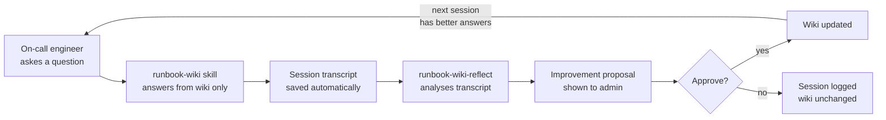

# DevOps Runbook Wiki

A self-improving runbook knowledge base for on-call engineers. Query it during incidents, and it learns from every session — gaps in coverage get proposed as wiki improvements after each query.


---

## The Problem

Runbooks go stale. Engineers write them once, incidents evolve, and the wiki slowly drifts from reality. The next on-call engineer searches for "connection pool exhausted" and finds a page last updated 18 months ago.

This system closes that loop: every session where the wiki couldn't answer a question becomes a proposal to fix it.

---

## How It Works



**Three skills, one loop:**

| Skill | When it runs | What it does |
|---|---|---|
| `/runbook-wiki` | During an incident | Answers from compiled wiki — no live tool calls, no raw configs |
| `/runbook-wiki-reflect` | After every session | Reads transcript, detects gaps, proposes improvements |
| `/runbook-wiki-ingest` | When configs change | Compiles SLO configs + service manifests into wiki pages |

---

## Wiki Structure

```
wiki/
├── incidents/
│   ├── _index.md          ← symptom triage — start here
│   ├── high-latency.md
│   ├── service-down.md
│   └── db-connection-failure.md
├── services/
│   ├── api-gateway.md     ← SLOs, alerts, common incidents per service
│   └── user-service.md
├── playbooks/
│   ├── _index.md
│   ├── rollback.md
│   ├── escalation.md
│   └── db-failover.md
├── runbooks/
│   └── latency-investigation.md
├── resolutions/           ← past resolved incidents (added over time)
└── learnings.md           ← what the reflect skill has learned and applied
```

---

## Using the Skills

### Query during an incident

```
/runbook-wiki api-gateway is returning high latency, p99 > 800ms
```

The skill reads `wiki/incidents/_index.md`, finds the matching incident page, reads the service page for SLO context, and returns a grounded answer with runbook link. It does not run commands.

### After the incident — run reflect

```
/runbook-wiki-reflect <session-id>
```

The reflect skill reads the session transcript, classifies what happened (protocol failure, wiki gap, or session went well), and proposes specific wiki improvements. You approve or reject before anything changes.

### When configs change — ingest

```
/runbook-wiki-ingest services
/runbook-wiki-ingest playbooks
```

Reads from `_git_snapshot/configs/` and `_git_snapshot/manifests/`, compiles structured wiki pages, updates `wiki/incidents/_index.md`.

---

## The Reflect Loop — Three Outcomes

After every session, reflect classifies it into one of three loops:

**Loop A — Protocol fix**: Claude read raw config files or called live tools. The wiki was fine — the skill made a mistake. Proposes a prompt correction, not a wiki change.

**Loop B — Wiki gap**: Claude followed the protocol correctly but the wiki didn't have the answer. Engineer rephrased the question 2+ times, or Claude expressed uncertainty. Proposes specific content to add.

**Loop C — No action**: Session went well. Logs what worked so the pattern isn't changed accidentally.

---

## Key Design Decisions

**Why no live tool calls during queries?** On-call is already high-stress. An assistant that calls kubectl or queries the DB during an incident adds blast radius risk and slows down the query. The wiki is the source of truth — the engineer runs commands, not the assistant.

**Why approve/reject before applying changes?** A reflect agent that auto-applies changes to a runbook wiki is dangerous. Bad proposals get applied at 3am before anyone notices. Every change goes through a human gate.

**Why ingest from raw configs rather than hand-writing wiki pages?** Service SLOs, alert thresholds, and escalation paths live in config files — not in wikis. If you hand-write the wiki, it drifts. Ingest compiles the config into the wiki on demand, keeping them in sync.

---

## Project Structure

```
devops-runbook-wiki/
├── .claude/skills/
│   ├── runbook-wiki/          # query skill
│   ├── runbook-wiki-reflect/  # improvement loop skill
│   └── runbook-wiki-ingest/   # config compiler skill
├── wiki/                      # compiled knowledge base
├── sessions/                  # session transcripts (auto-saved)
└── _git_snapshot/             # raw configs (host-managed, read-only)
```

---

## Author

Built by [Tanishka Marrott](https://github.com/TanishkaMarrott) — AI Agent Systems Engineer
